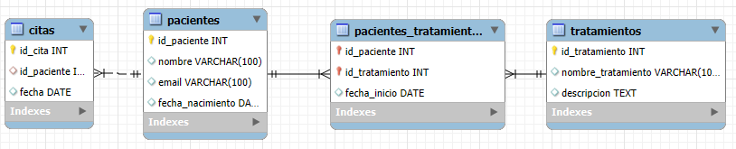
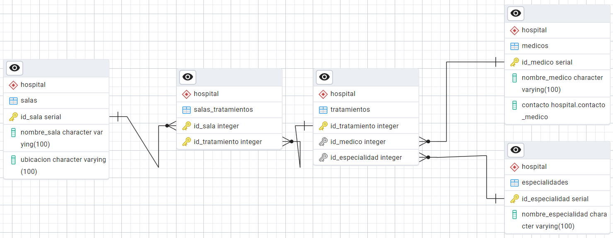


# **Proyecto**

---
### ⚠️ **ENTREGA**
- El nombre del fichero será `201.zip` y contendrá: 
  - Scripts SQL (`.sql`) que utilizaste para crear la BD MySQL y PostgreSQL y añadirle datos
  - Los archivos `.java` con el código de la aplicación.

---

---
### 💡 **SE VALORARÁ**

- El código no presenta problemas de ejecución.
- Las bases de datos son cargadas correctamente a partir de los scripts proporcionados.
- Los scripts de las bases de datos proporcionan datos de muestra para verificar la aplicación.
- Que el proyecto no sea entregado fuera de la fecha límite.

---

# **Descripción del proyecto**

En este proyecto habrá que modelar dos bases de datos. Una base de datos MySQL y una base de datos PostgreSQL.

La base de datos MySQL que habrá que modelar tiene el siguiente diagrama relacional:

Donde existen las siguientes relaciones:

- Una relación varios a varios entre `Pacientes` y `Tratamientos`.
- Una relación varios a uno entre `Pacientes` y `Citas`.

En cuanto a la base de datos PostgreSQL que habrá que modelar, esta tiene el siguiente diagrama relacional:

Donde existen las siguientes relaciones:

- Una relación varios a varios entre `Salas` y `Tratamientos`.
- Una relación varios a uno entre `Tratamientos` y `Especialidades`.
- Una relación varios a uno entre `Tratamientos` y `Medicos`.

Además, en la tabla `Medicos`, el atributo `datos_contacto` **representa un objeto** formado por los siguientes atributos: `nombre_contacto`, `nif`, `telefono` y `email`.

---

### ⚠️ **A TENER EN CUENTA**

Se deberá tener en cuenta que las tablas `Tratamientos` de ambas bases de datos permiten establecer el enlace entre ambas bases de datos. La información médica y clínica (pacientes, citas, tratamientos recibidos) se almacenará en MySQL, mientras que toda la información logística y profesional (personal médico, salas, especialidades) se almacenará en PostgreSQL.

---

---
### ⚠️ **DATOS**

Los script SQL de ambas bases de datos deberán añadir datos a modo de ejemplo que permitan probar las consultas.

---

## **Tareas a realizar**

- Diseñar una base de datos en MySQL (`hospital_mysql`) y PostgreSQL (`hospital_postgre`) que cumplan con los diagramas mostrados anteriormente.
- Insertar en las Bases de datos, datos ficticios que permitan probar los apartados de la aplicación.
- Desarrollar la aplicación Java usando JDBC para conectarte a las bases de datos.

La aplicación debe permitir:

- Establecer las conexiones con la base de datos MySQL y PostgreSQL de la forma más eficiente que conozcas.
- Crear un menú que permita probar cada uno de los siguientes apartados.
- Apartados a implementar: 
  1. Crear una nueva especialidad médica (PostgreSQL)
  2. Crear un nuevo médico (PostgreSQL)
  3. Eliminar un médico por ID (PostgreSQL)
  4. Crear un nuevo paciente (MySQL)
  5. Eliminar un paciente (MySQL)
  6. Crear nuevo tratamiento (`nombre`, `descripcion`, `especialidad`, `médico`) (MySQL + PostgreSQL)
  7. Eliminar un tratamiento por su nombre (MySQL + PostgreSQL)
  8. Listar tratamientos (menos de *X* pacientes asignados) (MySQL)
  9. Obtener el total de citas realizadas por cada paciente (MySQL)
  10. Obtener la cantidad de tratamientos por sala (PostgreSQL)
  11. Listar todos los tratamientos con sus respectivas especialidades y médicos (MySQL + PostgreSQL)
  12. Obtener todos los pacientes que han recibido un tratamiento de una especialidad dada (MySQL + PostgreSQL)

---
### ⚠️ **SOBRE LAS CONSULTAS**

Los apartados del 8 al 10 consisten en la realización de algún tipo de consulta. Salvo que el apartado indique lo contrario el resultado de la consulta tendrá que obtenerse ya sea con lenguaje SQL o PostgreSQL. Java solo podrá utilizarse para realizar la iteración para mostrar los datos por pantalla. O para juntar las tablas `producto` de ambas bases de datos.

---
## **Descripción técnica**
A continuación, se detallan los aspectos técnicos que habrán que tener en cuenta a la hora de implementar los apartados anteriores:

1. Crear una nueva especialidad médica (PostgreSQL)
   - Se implementará una función con la siguiente cabecera: `void crearEspecialidad(String nombreEspecialidad)`.
   - Se recibirá un String que será el `nombreEspecialidad` y se añadirá a la base de datos.
2. Crear un nuevo médico (PostgreSQL)
    - Se implementará una función con la siguiente cabecera: `void crearMedico(String nombreMedico, String nif, int telefono, String email)`.
   - Se recibirá todos los datos del nuevo médico y se añadirán en la base de datos.
3. Eliminar un médico por ID (PostgreSQL)
    - Se implementará una función con la siguiente cabecera: `void eliminarMedico(int id)`.
   - Se tendrá que comprobar si el `id` indicado existe y si es así, eliminarlo de la base de datos.
4. Crear un nuevo paciente (MySQL)
    - Se implementará una función con la siguiente cabecera: `void crearPaciente(String nombre, String email, LocalDate fechaNacimiento)`.
   - Se recibirán todos los datos del paciente.
5. Eliminar un paciente (MySQL)
    - Se implementará una función con la siguiente cabecera: `void eliminarPaciente(int id)`.
   - Se tendrá que comprobar si el `id` indicado existe y si es así, eliminarlo de la base de datos.
6. Crear nuevo tratamiento (`nombre`, `descripcion`, `especialidad`, `médico`) (MySQL + PostgreSQL)
    - Se implementará una función con la siguiente cabecera: `void crearTratamiento(String nombre, String descripcion, String nombreEspecialidad, String nifMedico)`.
   - Se tendrá que obtener el id de la especialidad y el id del médico a partir del nombre y del nif.
   - Se añadirá en la base de datos MySQL y en la base de datos PostgreSQL.
   - El identificador del tratamiento tendrá que ser el mismo en ambas bases de datos.
7. Eliminar un tratamiento por su nombre (MySQL + PostgreSQL)
    - Se implementará una función con la siguiente cabecera: `void eliminarTratamientoPorNombre(String nombre)`.
   - Se tendrá que eliminar el tratamiento de ambas bases de datos.
8. Listar tratamientos (menos de *X* pacientes asignados) (MySQL)
    - Se implementará una función con la siguiente cabecera: `void listarTratamientosConPocosPacientes(int cantidad)`.
   - Mediante una única consulta se tendrá que obtener el conjunto de filas resultante y mostrar el nombre de los tratamientos junto con su stock.
9. Obtener el total de citas realizadas por cada paciente (MySQL)
    - Se implementará una función con la siguiente cabecera: `void obtenerTotalCitasPorPaciente()`.
   - Mediante una consulta se tendrá que obtener toda la información e imprimir por pantalla: el nombre del paciente junto con el número de citas registradas.
10. Obtener la cantidad de tratamientos por sala (PostgreSQL)
- Se implementará una función con la siguiente cabecera: `void obtenerCantidadTratamientosPorSala()`.
    - Mediante una consulta se tendrá que obtener toda la información solicitada y pintar por pantalla el nombre de la sala y la cantidad total de tratamientos asociada a ella.
11. Listar todos los tratamientos con sus respectivas especalidades y médicos (MySQL + PostgreSQL)
- Se implementará una función con la siguiente cabecera: `void listarTratamientosConEspecialidadYMedico()`.
    - Se realizará una primera consulta en PostgreSQL que permita obtener el tratamiento, especialidad y médico.
  - Se realizará una consulta en MySQL para obtener el nombre del tratamiento y descripción.
  - Se concatenará y se mostrarán todos los datos indicados anteriormente usando Java.
12. Obtener todos los pacientes que han recibido un tratamiento de una especialidad dada (MySQL + PostgreSQL).
- Se implementará una función con la siguiente cabecera: `void obtenerPacientesPorEspecialidad(int idEspecialidad)`.
    - Se usará PostgreSQL para obtener los id_tratamiento con esa especialidad.
  - Se consultará en MySQL qué pacientes han recibido alguno de esos tratamientos.
  - Se mostrará por pantalla la lista de pacientes.

---
## 🔥 **SOBRE LAS ESPECIFICACIONES**

Si no se respetan las especificaciones de un apartado:

- Definición de la cabecera exacta,
- Número de consultas,
- Uso excesivo de Java para obtener los datos,
- etc.

El apartado se evaluará con un 0 aunque el funcionamiento y el resultado sea el correcto.

---

## Puntuación

| Actividad | Puntuación |
|------------|------------|
| Scripts de PostgreSQL y MySQL más datos para probar el programa | **0.1 puntos** |
| Conexiones eficientes con las bases de datos |  **0.1 puntos** |
| Crear nueva especialidad | **0.1 puntos** |
| Crear nuevo médico |  **0.1 puntos** |
| Eliminar un médico | **0.1 puntos** |
| Crear nuevo paciente |  **0.1 puntos** |
| Eliminar un paciente | **0.1 puntos** |
| Crear nuevo tratamiento | **0.25 puntos** |
| Eliminar un tratamiento por nombre | **0.25 puntos** |
| Listar tratamientos con menos pacientes |  **0.1 puntos** |
| Obtener el total de citas realizadas por cada paciente | **0.1 puntos** |
| Obtener la cantidad de tratamientos por sala |  **0.2 puntos** |
| Listar todos los tratamientos con sus respectivas especialidades y médicos | **0.2 puntos** |
| Obtener todos los pacientes que han recibido un tratamiento de una especialidad | **0.2 puntos** |
| **TOTAL** | **2 puntos** |

---

## 🔥 **SOBRE LAS ESPECIFICACIONES**

Si no se respetan las especificaciones de un apartado:

- Definición de la cabecera exacta
- Número de consultas
- Uso excesivo de Java para obtener los datos
- etc.

El apartado se evaluará con un **0** aunque el funcionamiento y el resultado sea el correcto.
